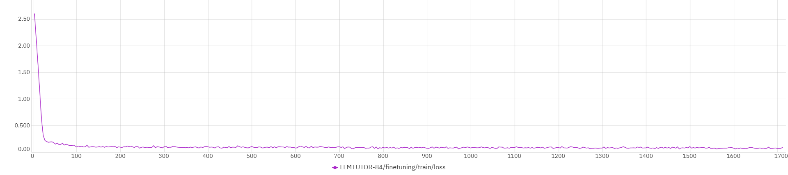
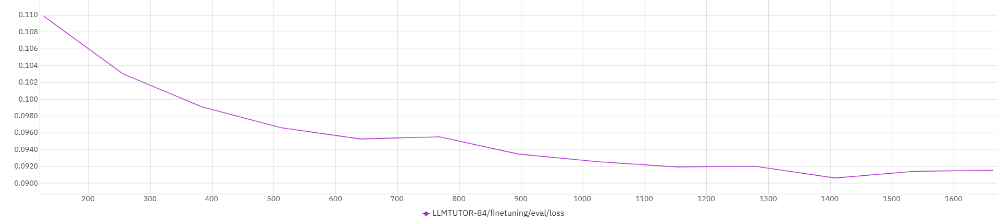

## SensorQA Vision LLM Fine-Tuning

### Dataset
This repository leverages the [SensorQA dataset](https://github.com/benjamin-reichman/SensorQA/tree/main) for question-answering tasks on wearable sensor data. SensorQA is constructed from the [Extrasensory dataset](http://extrasensory.ucsd.edu/), providing raw sensor data alongside single- or multi-day activity graphs. Each graph is paired with human-generated Q&A examples via crowdsourcing.

### Training and Evaluation (Llama 3.2-11B Vision Model)
1. **Fine-Tuning**  
   - Navigate to the `SensorQA_llama11b_vision` directory.  
   - Run `finetune_sensorqa.py` to fine-tune the Llama Vision model using activity graphs and corresponding Q&A pairs from the SensorQA dataset.  
   - Update your Hugging Face authentication tokens and local directory paths as needed.  
   - The script uses `sensorqa_train.parquet` and `sensorqa_val.parquet` to load data, which must point to the correct local paths of the activity graph images.

2. **Model Evaluation**  
   - Use `evaluate_sensorqa.py` with the model checkpoint at `weight/checkpoint-1664`.  
   - Both the original answers and the model's predictions will be saved to `results.txt`, enabling direct comparison.
3. Training and Eval loss for 3 epochs of finetuning with parameter efficient fine-tuning with LoRA:
   - Training Loss:
     
   - Eval Loss:
     
   
